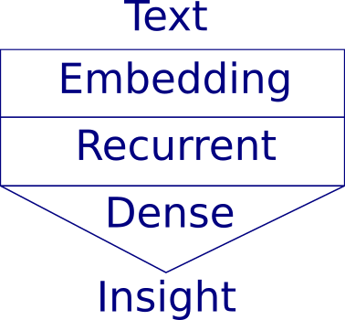

```{r setup, include=FALSE}
options(htmltools.dir.version = FALSE)

library(tidyverse)
```
# Agenda

--

## Keras for text sequences

--

## Challenges of the Czech language

--

## Possible solutions to them

--

## Two Tomios of Twitter

---
# Neural Network in Nutshell
--

## Ingests a matrix of numerical inputs

--

## Outputs a vector (or a matrix) of numerical outputs

--

## Inside is a bunch of clever math, from much of which we can abstract for the moment

---
# Keras Architecture for Text
--



--

⮞ Encoding - from words & sentences to a matrix of integers  

--

⮞ Embedding layer - from long sparse to short dense vectors  

--

⮞ Recurrent layer - the actual work of sequence "understanding"  

--

⮞ Dense layer - leads to a single (for binary classification) point unit  

--

⮞ Decoding - interpret a vector of probabilities


---
# Challenges of Czech Texts

--

### Small nation & small community

--

### Complicated grammatical inflections  

--

### ⮞ Large vocabulary of forms

--

### ⮞ Inflected words are rare events  

--

### Loose structure of sentences 

--
``` 
Prahou bloudil bílý kůň.
Bílý kůň bloudil Prahou.
```
---
# Tokenization

### Process of parsing text to string building blocks

--

### ⮞ character based (limited use)

--

### ⮞ word based (mainstream)   

--

### String tokens are replaced by numeric reference

--

### Constant vocabulary (dev / prod) is crucial

--

### Special value (zero) for padding to fixed length

---
# Lemmatization

### [Lemmatization](https://en.wikipedia.org/wiki/Lemmatisation) involves grouping together inflected forms of a word (dictionary form)
--

###  Both tokenziation and lemmatization can be performed via package [`udpipe` by úfal](http://ufal.mff.cuni.cz/udpipe) 
--
```{r lemma-hidden, eval = T, echo = F, message = F, cache = T}
library(tidyverse)
library(udpipe)

posledni_udpipe <- "czech-pdt-ud-2.3-181115.udpipe" # (zatím) poslední verze na netu

if (!file.exists(posledni_udpipe)) udpipe_download_model(language = "czech") # stačí jednou, má to přes 50 mega..i

udmodel <- udpipe_load_model(file = posledni_udpipe) # načtení modelu pro udpipe

```

```{r lemma-visible, echo = T, eval = T, cache = T}
white_horse <- paste("bílý kůň", "bílého koně","bílému koni",
                     "bílého koně","bílý koni","bílém koni",
                     "bílým koněm") # bílý kůň v 7 pádech

udpipe_annotate(udmodel, x = white_horse) %>%
  as.data.frame() %>% pull(lemma) %>% unique() %>% print()
```

---
# Recurrent layers for Czech
--

## In theory several options:  

--

⮞ simple RNN  
⮞ Long Short Term Memory (LSTM)  
⮞ Gated Recurrent Unit (GRU)  
⮞ others (ConvLSTM2D, CuDNNLSTM etc.) 

--

## In practice LSTM is often the best

--

### Bidirectional arrangement (usually) improves performance for Czech grammar 

---
# Tomio Okamura: real or fake?

--

Two Tomios of Twitter:  which one is the *real one*? [@tomio_cz](https://twitter.com/tomio_cz) or [@Tomio_Okamura](https://twitter.com/tomio_okamura)?  

--


--

Easy for humans, slightly more challenging for AI (not exactly impossible though :)

---
# Get Data

--

Tweets are downloaded with package `rtweet`, balanced via `caret` & lemmatized.

```{r stahnout-data, echo = T, eval = T, cache = T, message = F}
source("./code/1-stahnout-dataset.R") # stahnout dataset
source("./code/2-tweety-do-slov.R") # rozbít do slov (lemmat)
```

--
### A brief sample:

```{r ochutnavka, echo = F, eval = T}
tweets[tweets$name == "tomio_cz",]$text[1] %>% str_wrap(width = 60) %>% writeLines()
tweets[tweets$name == "Tomio_Okamura",]$text[1] %>% str_wrap(width = 60) %>% writeLines()
```

---
# Plain Vanilla LSTM

16 LSTM units, bidirectional + 1 dense point
--
```{r plain-vanilla, echo = T, eval = T, message = F, warning = F, cache = T, out.width = '100%', fig.align="center", fig.asp = 0.4, dpi = 150}
source("./code/3-plain-vanilla-BI-LSTM.R")
```
---

# Two LSTMs Stacked
2 × 16 LSTM units, bidirectional (stacked on top) + 1 dense point
--
```{r stacked, echo = T, eval = T, message = F, warning = F, cache = T, out.width = '100%', fig.align="center", fig.asp = 0.4, dpi = 150}
source("./code/4-stacked-BI-LSTM.R")
```
---

# Text (LSTM) + metadata

16 LSTM units, bidirectional + 2 extra inputs + 3 dense layers & 1 point
--
```{r metadata-included, echo = T, eval = T, message = F, warning = F, cache = T, out.width = '100%', fig.align="center", fig.asp = 0.4, dpi = 150}
source("./code/5-BI-LSTM+extra-data.R")
```
---
# Conclusions

--

### Keras neural network architecture is very flexible (at computational cost)

--

### Keras tokenizer is *not* a good first choice for Czech language (udpipe is)

--

### Lemmatization of text decreases form variance without sacrificing (too much) information

--

### Bigger (both network and dataset) is usually better than what was shown in Tomio examples

---
class: inverse, middle, center

# Closing Remarks

--

### Text classification with [`keras`](https://keras.rstudio.com/) & [`udpipe`](https://github.com/bnosac/udpipe) is fun!

--
<br>
This presentation (including source code) is on GitHub  
[https://github.com/jlacko/ml-meetup-text](https://github.com/jlacko/ml-meetup-text)  

--
<br><br>
Jindra Lacko  
[jindra@jla-data.net](mailto:jindra@jla-data.net)  
[www.jla-data.net](http://www.jla-data.net)  

